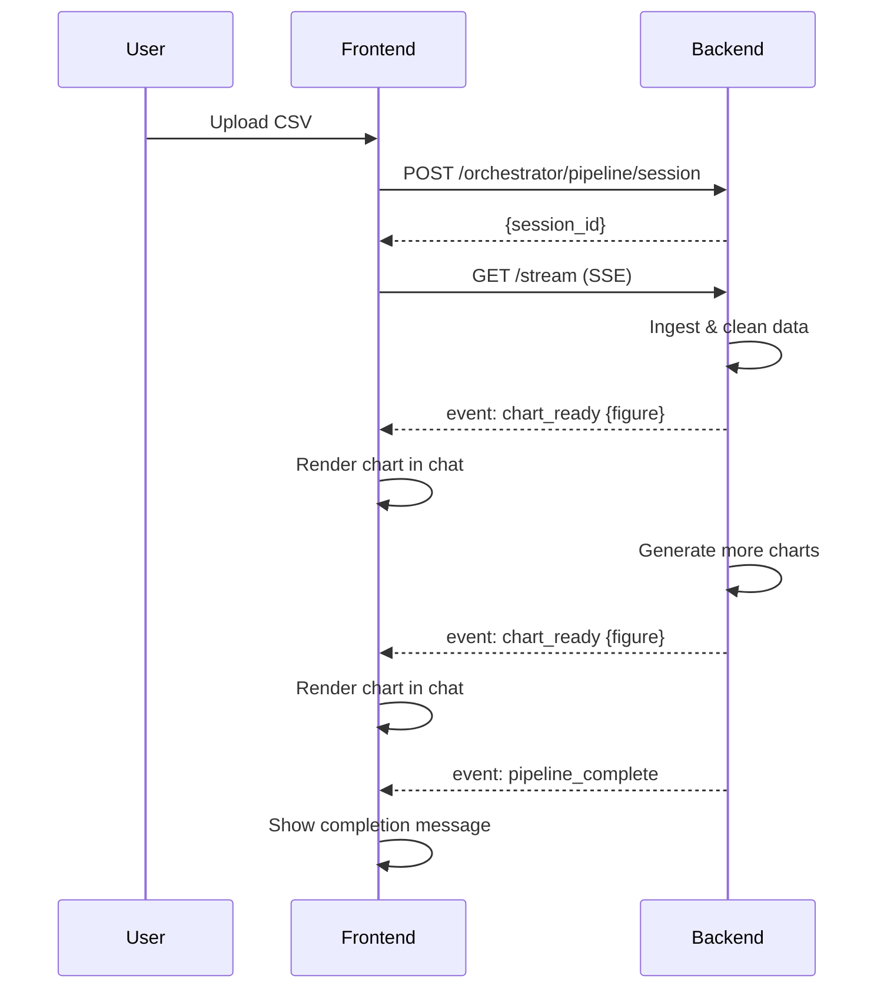
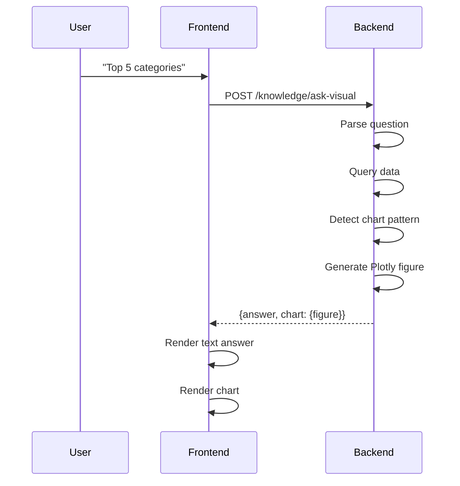

# DataCue: Interactive AI Data Analyst with Real-Time Chart Streaming

## Overview

DataCue is an AI-powered data analytics assistant that combines conversational chat with live visualization streaming. Upload a CSV/Excel file and watch as charts appear in real-time during processing, then continue asking questions to generate new insights and visualizations on demand.

## User Workflow

### 1. Upload & Real-Time Analysis

1. **Upload File**: Click the upload button in the chat or drag a CSV/Excel file
2. **Live Progress**: Watch status updates stream in real-time:
   - "📁 Upload received. Preparing analysis…"
   - "🔍 Reading CSV and validating columns…"
   - "📊 Generating summary statistics…"
   - **Charts appear automatically** as they're generated
3. **Completion**: Receive confirmation when analysis is complete

### 2. Conversational Data Exploration

Once processing completes, ask natural language questions:

**Example queries that generate charts:**

- "Show top 5 products by sales" → Bar chart
- "What's the average value?" → Metric indicator
- "Distribution of prices" → Histogram
- "Sales by region" → Grouped bar chart
- "Correlation between columns" → Heatmap

**Charts appear inline in the chat** alongside text answers.

## Technical Architecture

### Backend (FastAPI + SSE)

#### Real-Time Chart Streaming During Pipeline

**File:** `backend/services/orchestrator_service.py`

```python
# Stream charts as they're generated
for idx, chart in enumerate(charts[:5]):
    emit("chart_ready", {
        "chart_index": idx,
        "chart_id": chart.get("id"),
        "chart_type": chart.get("type"),
        "title": chart.get("title"),
        "figure": chart.get("figure"),  # Plotly JSON
        "insights": chart.get("insights"),
    })
```

**SSE Events:**

- `chart_ready`: Individual chart data (Plotly JSON)
- `pipeline_complete`: Final results with all charts
- `error`: Failure notification

#### Chat-Based Visual Queries

**Endpoint:** `POST /knowledge/ask-visual`

**File:** `backend/routers/knowledge_router.py`

```python
@router.post("/ask-visual")
def ask_visual_question(payload: VisualQueryRequest):
    """
    Answer questions with optional chart generation.
    Returns: {success, answer, chart: {type, title, figure}}
    """
    result = service.ask_visual(
        question=payload.question,
        generate_chart=payload.request_chart
    )
    return clean_response(result)
```

**Chart Generation Logic:**

- Query engine interprets question
- Detects chart-worthy patterns (top N, aggregations, distributions)
- Generates Plotly figure JSON automatically
- Returns both text answer + chart

### Frontend (React + react-plotly.js)

#### Chart Message Component

**File:** `client/src/components/ChartMessage.jsx`

Features:

- Renders Plotly charts with dark theme
- Hover interactions and tooltips
- Fullscreen expansion
- Download button
- Shows insights below chart

#### Chat Integration

**File:** `client/src/pages/ChatPage.jsx`

**SSE Listener:**

```javascript
if (data.stage === "chart_ready" && data.payload) {
  appendMessage({
    role: "chart",
    chart: data.payload,
    timestamp: buildTimestamp(),
  });
}
```

**Visual Query Handler:**

```javascript
const payload = await response.json();

// Append text answer
appendMessage({
  role: "assistant",
  content: normaliseAnswer(payload),
  timestamp: buildTimestamp(),
});

// Append chart if present
if (payload.chart && payload.chart.figure) {
  appendMessage({
    role: "chart",
    chart: payload.chart,
    timestamp: buildTimestamp(),
  });
}
```

## Data Flow

### Upload → Live Charts



### Chat → Visual Answer



## Chart Types Supported

### Automatically Generated (Pipeline)

- **Histograms**: Numeric distributions
- **Bar charts**: Categorical frequencies
- **Time series**: Temporal trends
- **Scatter plots**: Correlations
- **Heatmaps**: Correlation matrices
- **Grouped bars**: Category vs measure
- **Treemaps**: Hierarchical data
- **Funnels**: Conversion flows
- **Sankey**: Flow diagrams
- **Stacked areas**: Time series composition

### On-Demand (Chat Queries)

- **Bar charts**: Top N, aggregations
- **Indicators**: Single metrics
- **Custom visualizations**: Based on query type

## Key Features

### Real-Time Experience

- **Streaming status updates** during processing
- **Charts appear incrementally** as they're generated
- **No page refresh** needed
- **Instant feedback** on every action

### Interactive Charts

- **Hover tooltips** with data details
- **Zoom and pan** capabilities
- **Fullscreen mode** for detailed exploration
- **Download as PNG** for sharing
- **Dark theme** optimized for DataCue UI

### Intelligent Query Handling

- **Natural language** understanding
- **Automatic chart selection** based on question type
- **Fallback to text** if chart not applicable
- **Combined text + visual** answers

## Setup & Installation

### Backend Dependencies

```bash
cd backend
pip install fastapi uvicorn plotly pandas
```

### Frontend Dependencies

```bash
cd client
npm install react-plotly.js plotly.js
```

### Run the Application

**Backend:**

```bash
cd backend
uvicorn main:app --reload --host 0.0.0.0 --port 8000
```

**Frontend:**

```bash
cd client
npm run dev
```

**Access:** http://localhost:5173

## API Reference

### SSE Stream Endpoints

#### `POST /orchestrator/pipeline/session`

Create analysis session and get session ID.

**Response:**

```json
{
  "session_id": "uuid-string"
}
```

#### `GET /orchestrator/pipeline/session/{session_id}/stream`

Subscribe to SSE stream for live updates.

**Events:**

- `data: {"stage": "chart_ready", "payload": {...}}`
- `data: {"stage": "pipeline_complete", "payload": {...}}`

### Visual Query Endpoints

#### `POST /knowledge/ask-visual`

Ask question and get text + optional chart.

**Request:**

```json
{
  "question": "Top 5 products by revenue",
  "request_chart": true
}
```

**Response:**

```json
{
  "success": true,
  "answer": "The top 5 products are...",
  "chart": {
    "type": "bar",
    "title": "Top 5 Products",
    "figure": {
      /* Plotly JSON */
    }
  },
  "method": "query_engine"
}
```

## Troubleshooting

### Charts Not Appearing

1. **Check browser console** for errors
2. **Verify react-plotly.js** is installed: `npm list react-plotly.js`
3. **Restart backend** to load chart streaming logic
4. **Test SSE connection** manually via browser dev tools

### Empty/Broken Charts

1. **Validate Plotly JSON** structure in backend
2. **Check chart.figure** is not null in SSE payload
3. **Inspect ChartMessage component** for render errors
4. **Verify dark theme colors** are visible on black background

### Performance Issues

1. **Limit charts streamed** (currently 5 max during pipeline)
2. **Use chart recommendations** from dashboard generator
3. **Optimize Plotly config** (disable modebar, reduce animations)
4. **Lazy load** charts outside viewport

## Future Enhancements

- **Chart filtering**: Click a bar to filter other charts
- **Drill-down**: Expand chart to show detailed data
- **Chart export**: Save as HTML, SVG, or PNG
- **Chart editing**: Adjust colors, labels, and styles in-chat
- **3D visualizations**: For complex multi-dimensional data
- **Animated charts**: Show temporal changes over time
- **Collaborative annotations**: Mark insights on charts

## Contributing

When adding new chart types:

1. **Backend**: Add generation logic to `chart_factory.py`
2. **Backend**: Update `_generate_chart_from_query` in `knowledge_service.py`
3. **Frontend**: ChartMessage component auto-handles Plotly JSON
4. **Test**: Upload sample data and verify streaming + on-demand rendering

---

**Built with**: FastAPI • React • Plotly • Server-Sent Events • Pandas • Tailwind CSS
